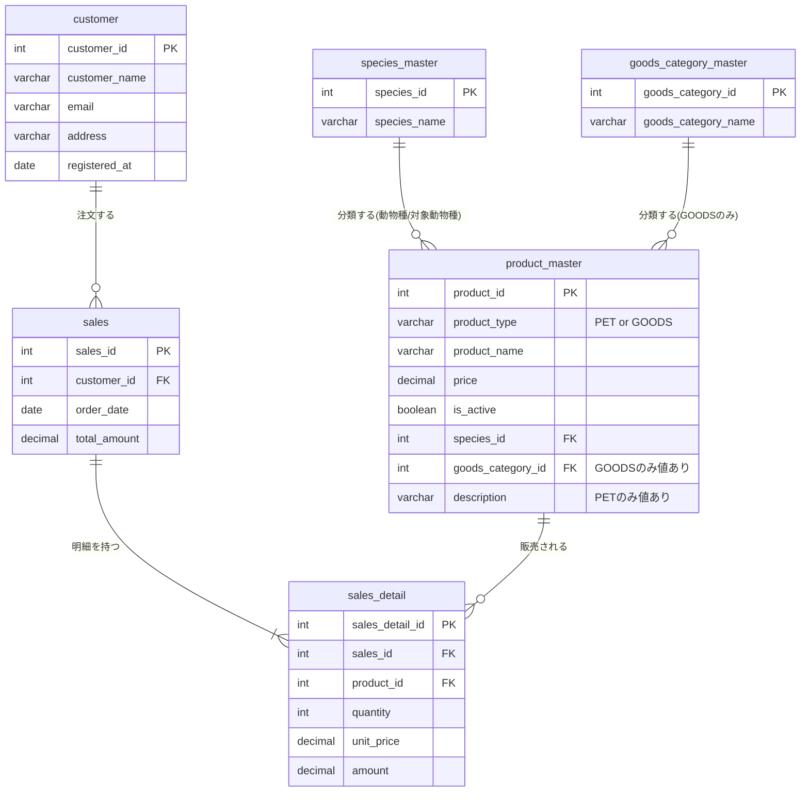

# オンラインペットショップ ER図

## テーブル一覧

| 物理名 | 論理名 | 説明 |
|---|---|---|
| `customer` | 顧客 | オンラインペットショップの購入者情報。区分値のようなマスタではないため、他マスタとは独立したエンティティとして位置づけている。 |
| `species_master` | ペット種類マスタ | 犬・猫・鳥・魚・爬虫類など、ペットの動物種を管理する区分値マスタ。 |
| `goods_category_master` | グッズ種類マスタ | えさ・すみか・遊び道具など、グッズの分類を管理する区分値マスタ。 |
| `product_master` | 商品マスタ（ペット・グッズ統合） | 販売するペットとグッズを1テーブルに統合した商品マスタ。`product_type`で両者を区別し、`species_id`（両タイプ共通）・`goods_category_id`（GOODSのみ）・`description`（PETのみ）を持つ。 |
| `sales` | 売上 | 顧客からの注文（受注）ヘッダ。1行が1回の注文に対応する。 |
| `sales_detail` | 売上明細 | 売上に紐づく商品ごとの明細行。数量・単価・金額を保持する。 |
